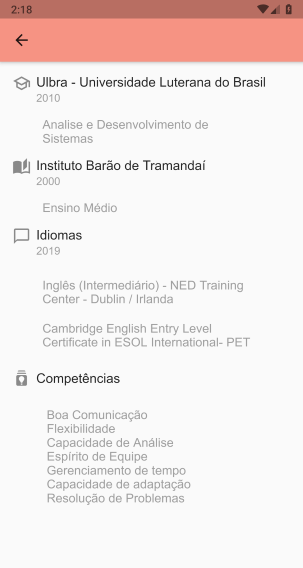

<h1 align="center">
    <a href="https://flutter.dev/"> Flutter</a>
</h1>

 A resumé using Flutter

<h4 align="center"> 
	🚧   🚀 Completed  🚧
</h4>

  <b>Getting Started</b>

- Get Flutter <a href="https://flutter.dev" rel="nofollow">here</a> if you don't already have it
- Clone this repository.
- cd into the repo folder.
- run flutter run-android

<b>Technologies:</b>

 -[Flutter] (<a href="https://flutter.dev" rel="nofollow">https://flutter.dev</a>) 
 -[Android SDK] (<a href="https://developer.android.com/studio" rel="nofollow">https://developer.android.com/studio</a>) 
 -[Dart] (<a href="https://dart.dev" rel="nofollow">https://dart.dev</a>)
 

<b>Screenshots:</b>
 
 <table style="width:100%">
  <tr>
    <td><h1 align="center">
  
</h1></td>
    <td><h1 align="center">
  
</h1>
	</tr>
	  <tr>
	  </td> 
    <td><h1 align="center">
  
</h1></td>
  </tr>
 </table>
 
 
 
### Autor
---
 
  
 <b>Adrien Schmitz/b></a>

  

Este projeto esta sobe a licença <a href="https://github.com//adrienschmitz/profile_app/blob/main/LICENSE">MIT</a>
